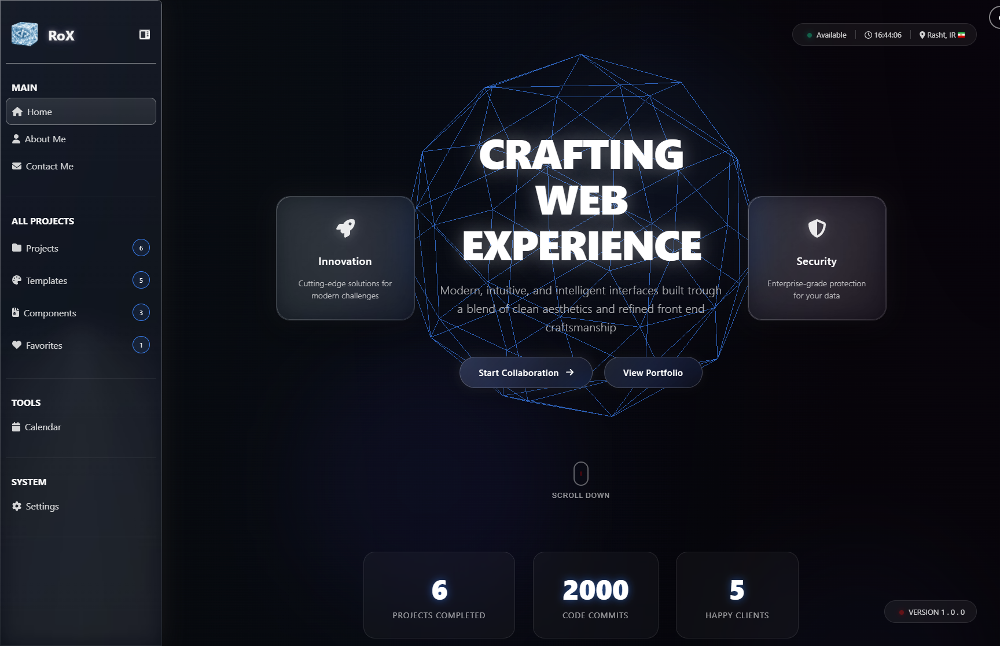

🧑‍💻 Project Title

RoX

---

📌 Description

A modern and futuristic personal portfolio showcasing my web development skills, UI/UX design, and completed projects.

---

🎨 Design Philosophy

I went for a dark, modern vibe and mixed it with a liquid‑glass look to give the whole interface more depth and personality. The soft transparency, glossy layers, and subtle highlights make everything feel clean and futuristic without being too loud. Overall, the goal was to keep things minimal, smooth, and visually sharp — something that feels modern but still has its own character.

---

🚀 Features

• Modern UI
• Clean & Minimal
• Smooth Experience
• Futuristic Vibes
• Structured Layout

---

🛠 Tech Stack

• HTML5
• CSS
• JavaScript

---

📂 Project Structure

/
├── index.html
├── assets/
│   ├── images/
│   ├── icons/
├── pages/
│   ├── Home.html
│   ├── About.html
│   ├── Contact.html
│   ├── Projects.html
│   ├── Templates.html
│   ├── Components.html
│   ├── Favorite.html
│   ├── Calendar.html
│   └── Settings.html
├── pages styles/
│   ├── Home.css
│   ├── About.css
│   ├── Contact.css
│   ├── Projects.css
│   ├── Favorite.css
│   ├── Calendar.css
│   └── Settings.css
├── js/
│   ├── data.js
│   ├── home.js
│   ├── routes.js
│   ├── main.js
│   └── Translate.js

└── README.md

---

🧩 Pages & Modules

Home Page

The home page introduces the core identity of the website with a modern dark layout. It highlights your main message, showcases key stats, and presents what you offer through clean sections like skills, featured projects, design templates, components, and a short Q&A. It’s designed to give visitors a quick, clear picture of who you are and what you create..

About Page

The About Me page gives a clear and personal introduction to who you are as a developer. It highlights your background, your approach to work, and the values you bring to every project. The page includes a short bio, key principles you follow, your current focus, long‑term goals, a timeline of your journey, a visual skill chart, and a section showcasing your latest blog posts. Altogether, it helps visitors quickly understand your personality, experience, and the way you work.

Contact Page

The Contact page makes it easy for clients to reach out and start a project. It includes your direct contact information, location, availability, and a project kick‑off form where visitors can share their details and project goals. The page also outlines your three‑step workflow, giving people a clear idea of how collaboration will move forward from the first message to final delivery.

Projects Page

The Projects page showcases all your work in a clean, filterable grid. Visitors can browse projects by category, view quick descriptions, and explore each item in detail. It’s designed to make your portfolio easy to navigate and highlight the range of skills and project types you’ve worked on.

Favorites Page

The Favorites page collects your saved projects in one clean, easy‑to‑access space. It lets visitors quickly view the work you’ve marked as important or worth highlighting, with simple actions to open each project and explore it further.

Calendar Page

The Calendar page gives you a clean monthly view to track dates, plan tasks, and stay organized. It’s designed to fit seamlessly into the dashboard, making scheduling simple and visually clear

---

📸 Screenshots

---

🌐 Live Demo

https://roxcom.netlify.app/#home

---

📞 Contact

• Email: Rohamkm13pl@gmail.com
• Instagram:
• GitHub: Rohamkm13
• Location: IR Rasht
